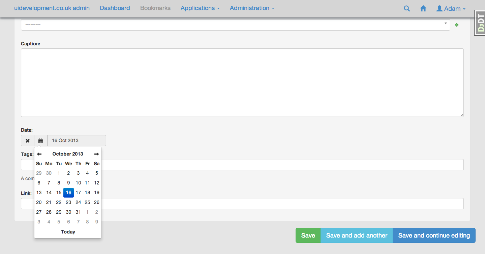
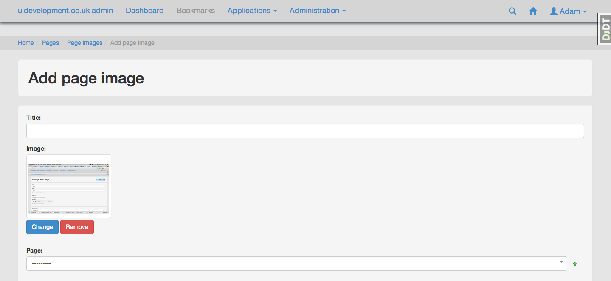

Django Admin Bootstrap theme
============================

Twitter Bootstrap support for Django Admin. Requires django-admin-tools and mediagenerator packages.
It also requires SASS to be installed.

This module started out life here:

https://bitbucket.org/salvator/django-admintools-bootstrap

I've developed it to fit into my preferred Django stack that includes mediagenerator and SASS. I've also updated to Bootstrap 3 and fixed a few bugs, as well as restyling things and including Glyphicons.

I'm currently trying to get this included as part of Django proper. Please star it if you would like to see it included as part of Django. Please remember that this is just a quick prototype and will be fully tested if accepted.

Screenshots
-----------

Features
--------

* Bootstrap 3
* Much nicer widgets for images and dates
* More responsive
* Some nice icons
* Dashboard
* Cleaner javascript
* Feincms tree editor support
* Admin Widgets easier to extend with custom templates

Install
-------

 $ pip install -e hg+https://github.com/spenoir/django-admintools-bootstrap#egg=admintools_bootstrap

* Insert `admintools_bootstrap` to your INSTALLED_APPS before `admin_tools` and `django.contrib.admin` apps.
* Make sure you have static files application installed and configured. See https://docs.djangoproject.com/en/dev/ref/contrib/staticfiles/ for details.
* add the following below where MEDIA_BUNDLES is set in your settings file:

    from admintools_bootstrap.settings import ADMIN_MEDIA_BUNDLES
    MEDIA_BUNDLES += ADMIN_MEDIA_BUNDLES

* Enjoy.

Widgets
-------

There are some custom widgets for your pleasure including a nice image widget I picked up and a bootstrap-datetimepicker.js implementation.
To use these widgets, just subclass admintools_bootstrap.models.BootstrapModelAdmin in your admin.py files

	from admintools_bootstrap.models import BootstrapModelAdmin

	class ExampleAdmin(BootstrapModelAdmin):
	...

Alternatively if you are already subclassing something else you can simply do it like this using formfield_overrides:

	class ExampleModelAdmin(admin.ModelAdmin):

		formfield_overrides = {
	        DateTimeField: {'widget': BootstrapAdminSplitDateTime},
	        DateField: {'widget': BootstrapAdminDateWidget},
	        ImageField: {'widget': BootstrapAdminImageWidget},
	    }

Site name in navigation bar and title
-------------------------------------

admintools-bootstrap can use current site to display site name in admin interface.

To enable this feature, add `django.contrib.sites` to your `INSTALLED_APPS` list (if you have not yet).

Set site name and domain in `django.contrib.sites` admin.

Settings
--------

Site link::

 ADMINTOOLS_BOOTSTRAP_SITE_LINK = '/'

If not False, display specified link to site in the top panel

Media generator bundles are created for admin.js and admin.css.

Used software:
--------------

* http://twitter.github.com/bootstrap/
* https://bitbucket.org/izi/django-admin-tools/
* http://www.crummy.com/software/BeautifulSoup/
* https://github.com/jezdez/django-appconf
* http://pypi.python.org/pypi/versiontools
* https://bitbucket.org/wkornewald/django-mediagenerator/
* http://sass-lang.com/
* bootstrap-datetimepicker.js
* some nice image widget which i'll find the link for!

TODO
----

* better mobile support
* get rid of those green plus icons!
* improve the dashboard views
